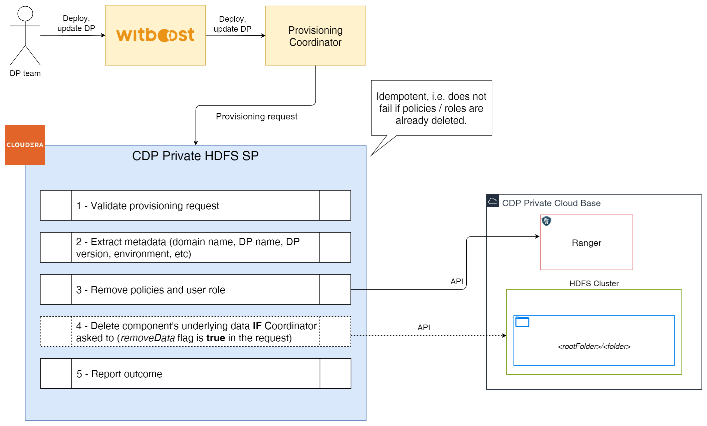
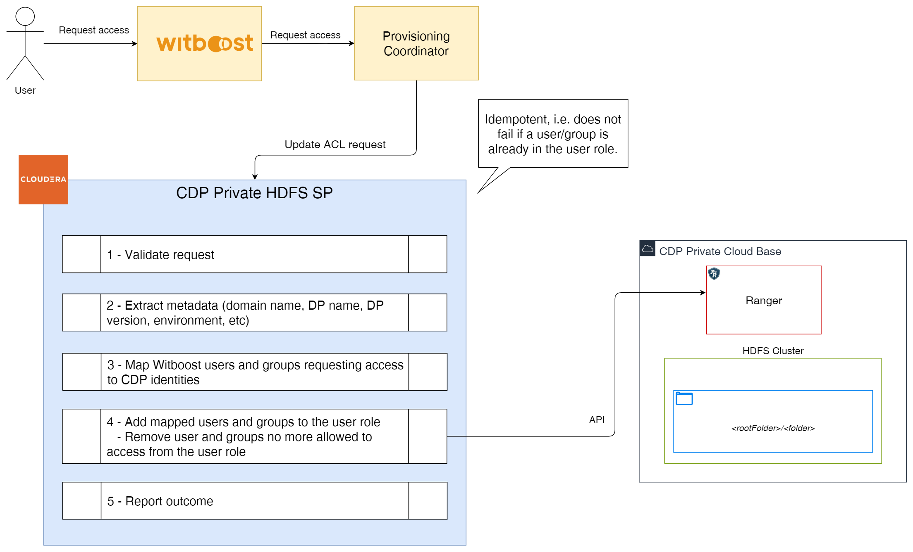

# High Level Design

This document describes the High Level Design of the CDP Private HDFS Specific Provisioner.
The source diagrams can be found and edited in the [accompanying draw.io file](hld.drawio).

## Overview

### Specific Provisioner

A Specific Provisioner (SP) is a service in charge of performing a resource allocation task, usually
through a Cloud Provider. The resources to allocate are typically referred to as the _Component_, the
details of which are described in a YAML file, known as _Component Descriptor_.

The SP is invoked by an upstream service of the Witboost platform, namely the Coordinator, which is in charge of orchestrating the creation
of a complex infrastructure by coordinating several SPs in a single workflow. The SP receives
the _Data Product Descriptor_ as input with all the components (because it might need more context) plus the id of the component to provision, named _componentIdToProvision_

To enable the above orchestration a SP exposes an API made up of five main operations:
- validate: checks if the provided component descriptor is valid and reports any errors
- provision: allocates resources based on the previously validated descriptor; clients either receive an immediate response (synchronous) or a token to monitor the provisioning process (asynchronous)
- status: for asynchronous provisioning, provides the current status of a provisioning request using the provided token
- unprovision: destroys the resources previously allocated.
- updateacl: grants access to a specific component/resource to a list of users/groups

### HDFS

Hadoop Distributed File System (HDFS) is a Java-based file system for storing large volumes of data. Designed to span large clusters of commodity servers, HDFS provides scalable and reliable data storage.

An HDFS cluster contains the following main components: a **NameNode** and **DataNodes**.

The NameNode manages the cluster metadata that includes file and directory structures, permissions, modifications, and disk space quotas. The file content is split into multiple data blocks, with each block replicated at multiple DataNodes.


The NameNode actively monitors the number of replicas of a block. In addition, the NameNode maintains the namespace tree and the mapping of blocks to DataNodes, holding the entire namespace image in RAM.

High-Availability (HA) clusters contain a standby for the active NameNode to avoid a single point of failure. These clusters use JournalNodes to synchronize the active and standby NameNodes.

### CDP Private HDFS Specific Provisioner

This Specific Provisioner interacts with a CDP Private Environment by creating a `folder` structure inside HDFS.

The folder path and name should be composed in a way to not interfere with other Data Products and/or other components of the same type in the same Data Product. The provisioner doesn't enforce any naming convention and will create the folder structure based on the input descriptor based on two fields: A root folder which expects all the data product resources to be contained within (and thus used on the Security Zone), and the component specific folder as a path that will be created inside the root folder. We recommend the following structure:

```yaml
rootFolder: data-products/$domainName/$dataProductName/$dataProductMajorVersion/
folder: $componentName/
```

Appropriate permissions are granted to the created folder.

## Provisioning

Four main operations are executed on provisioning phase:
1. Request validation
2. Map of the Witboost identities to CDP identities
3. Security zone, roles (_OWNER_ and _USER_) and policies creation in Apache Ranger
4. Creation of the folder structure in HDFS


## Unprovisioning

Unprovisioning consists of removing the existing _policies_ and _USER role_ in Apache Ranger.

If the Coordinator sends the `removeData` flag with a **true** value in the request, then the component's underlying data is deleted.



## Update Acl

Three main operations are executed on this phase:
1. Request validation
2. Map of the Witboost identities requesting access to CDP identities
3. Add mapped users and groups to the _USER role_ in Apache Ranger (removing user and groups no more allowed to have access)


